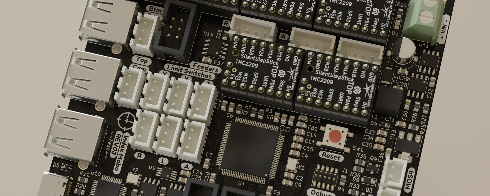

---
# Feel free to add content and custom Front Matter to this file.
# To modify the layout, see https://jekyllrb.com/docs/themes/#overriding-theme-defaults

# <span class="badge badge-primary">Github CI</span>
#<span class="badge badge-secondary">Web Service</span>
#<span class="badge badge-success">Open Source</span>
#<span class="badge badge-danger">Paid Service</span>
#<span class="badge badge-info">Free Service</span>

title: "Documentation Tools"
layout: single
header:
  overlay_color: "#000"
  overlay_filter: "0.65"
  overlay_image: /assets/feature.jpg
  caption: "Photo credit: **Tobias Netzer**"
sidebar:
  nav: "docs"
---

## Docs Site

### [Github Pages](https://pages.github.com/)
<span class="badge badge-primary">Github CI</span><span class="badge badge-info">Free Service</span>

Regardless of the static site generator you choose, using Github Pages as the hosting service for your documentation is a great choice. It is free to deploy, completely automatic after your CI script is set, and there's tons of documentation around getting started. Plus, managing your documentation in git means it's incredibly easy to manage docs release alongside product updates.

### MKDocs
<span class="badge badge-success">Open Source</span><span class="badge badge-primary">Github CI</span>

MKDocs is by far the easiest and most straightforward to get beautiful documentation on the web. Accepting garden-variety Markdown as the copy format, it's dead simple to write for, and the results look spectacular. MKDocs also is [very easily deployable](https://github.com/opulo-inc/docs/blob/main/.github/workflows/ci.yaml) using Github Pages, so a simple `git push origin main` will deploy your doc instructions to production. Fixing a bug on the site can literally be a less than a minute ordeal.

## Community

### [Discord](https://discord.com/)
<span class="badge badge-info">Free Service</span>

Discord is effectively a nice UI wrapped around the basics of IRC. Many communities have flocked to Discord as a place for conversation over the past 5 years, and in response Discord recently released a number of community-specific features that make this even easier. Some pithy features are gated behind a paywall, but the basic communication functionality is fantastic for building an engaged community. Given that it's real-time text communication, discussions can happen much faster than in something like a forum.

### [Discourse](https://www.discourse.org/)
<span class="badge badge-success">Open Source</span><span class="badge badge-info">Free Service</span>

Discourse is the best way to build your own forum. Although conversation might happen a bit slower in a forum rather than a Discord server, the results of discussions are highly searchable, and a forum setting is more familiar to some folks than a real-time chat app.

## Export/Render

MCAD automation tools are mostly geared towards exporting as STLs or STEPs for 3D printing, or rendering an image for viewing/BOM usage. Open CAD packages like FreeCAD, OpenSCAD, and CADQuery take the most advantage of this, handling all exports using their CLI interfaces. Proprietary tools can take advantage of automatic rendering by first exporting to an interchange format. See bulk exporting for [Fusion360](https://www.autodesk.com/support/technical/article/caas/sfdcarticles/sfdcarticles/How-to-export-specific-bodies-in-a-file-to-a-STEP-file-from-Fusion-360.html) and [Solidworks](https://help.solidworks.com/2023/english/WhatsNew/c_wn2023_import_export_assembly_step.htm?id=4dca041efcda481ca1e9f214d4725333#:~:text=You%20can%20export%20large%20SOLIDWORKS,assemblies%20as%20atomic%20STEP%20files.).

### [AutoBOM](https://github.com/opulo-inc/lumenpnp/blob/main/.github/workflows/export-bom.yaml) (Opulo's BOM Generator)
<span class="badge badge-success">Open Source</span><span class="badge badge-primary">Github CI</span>

AutoBOM is a series of Python scripts and CI builds developed by Opulo that automatically exports a standalone downloadable webpage Bill of Materials based on a GitHub repo. AutoBOM expects to find an up-to-date `bom.csv` file in the repo's root directory, and that source files are made with FreeCAD and KiCAD. The BOM will even include rendered images of all FreeCAD files and KiCAD PCBs included in the `bom.csv`. You can see an example by downloading the BOM.zip file attached to the most recent release [here](https://github.com/opulo-inc/feeder/releases/).

### FreeCAD STL Export
<span class="badge badge-success">Open Source</span><span class="badge badge-primary">Github CI</span>

### OpenSCAD STL Rendering
<span class="badge badge-success">Open Source</span><span class="badge badge-primary">Github CI</span>

[OpenSCAD CLI Manual](https://en.wikibooks.org/wiki/OpenSCAD_User_Manual/Using_OpenSCAD_in_a_command_line_environment)

```
openscad 
  -o part.png
  --colorscheme BeforeDawn
  --imgsize 512,512
  --quiet --render --projection=o --viewall --hardwarnings
  ./part.scad
```

### Blender .blend Rendering

[CLI rendering in Blender](https://docs.blender.org/manual/en/latest/advanced/command_line/render.html)

### [KiBot](https://github.com/INTI-CMNB/KiBot)
<span class="badge badge-success">Open Source</span><span class="badge badge-primary">Github CI</span>

KiBot is an export tool for KiCAD designs. KiBot is capable of exporting gerbers of your board, 3D models, images, stencils, and even run ERC/DRC a final time before export.

KiBot is great for automating the export of gerber files on release, or when run manually in GitHub. It can also help with exporting images of PCBs for documentation purposes. For example, Opulo feeders have a [CI workflow](https://github.com/opulo-inc/feeder/blob/main/.github/workflows/export-ecad.yaml) that automatically exports all feeder PCBs for easy community use and reference.

### [pcb2blender](https://github.com/30350n/pcb2blender)
<span class="badge badge-success">Open Source</span>

Turn KiCad designs into Blender files to create beautiful renders for your PCBs!



## Web Viewers

### [3dviewer.net](https://3dviewer.net/)
<span class="badge badge-success">Open Source</span><span class="badge badge-info">Free Service</span>

<iframe width="640" height="480" style="border:1px solid #eeeeee;" src="https://3dviewer.net/embed.html#model=https://raw.githubusercontent.com/opulo-inc/lumenpnp/main/pnp/cad/FDM/back-leg.FCStd$camera=-217.09205,134.93892,8.02837,-34.00000,0.00000,-85.00000,0.00000,1.00000,0.00000,45.00000$projectionmode=perspective$envsettings=fishermans_bastion,off$backgroundcolor=255,255,255,255$defaultcolor=200,200,200$defaultlinecolor=100,100,100$edgesettings=off,0,0,0,1"></iframe>

3D Viewer is a fantastic tool for sharing and viewing FreeCAD source files (among many others). You can easily share links to view a FreeCAD file that's hosted on Github. [Example](https://3dviewer.net/#model=https://github.com/opulo-inc/lumenpnp/blob/main/pnp/cad/FDM/back-leg.FCStd) It also has embedding support, allowing you to put a 3d viewer on your own site, which you can see above.


### [KiCanvas](https://kicanvas.org/)
<span class="badge badge-success">Open Source</span><span class="badge badge-info">Free Service</span>

KiCanvas is a fantastic tool for sharing and viewing KiCAD source files. You can paste a GitHub link into [KiCanvas.org](https://kicanvas.org/) to immediately view in-browser. You can also easily share [links](https://kicanvas.org/?github=https%3A%2F%2Fgithub.com%2Fopulo-inc%2Ffeeder%2Ftree%2Fmain%2Fpcb%2Fmobo) to view a FreeCAD file that's hosted on Github. KiCanvas also has embedding support, allowing you to put a KiCanvas viewer on your own site.

<kicanvas-embed src="https://raw.githubusercontent.com/opulo-inc/lumenpnp/main/pnp/pcb/mobo/mobo.kicad_pcb" controls="basic"> </kicanvas-embed>


### [Tracespace](https://tracespace.io/view/)
<span class="badge badge-info">Free Service</span>

